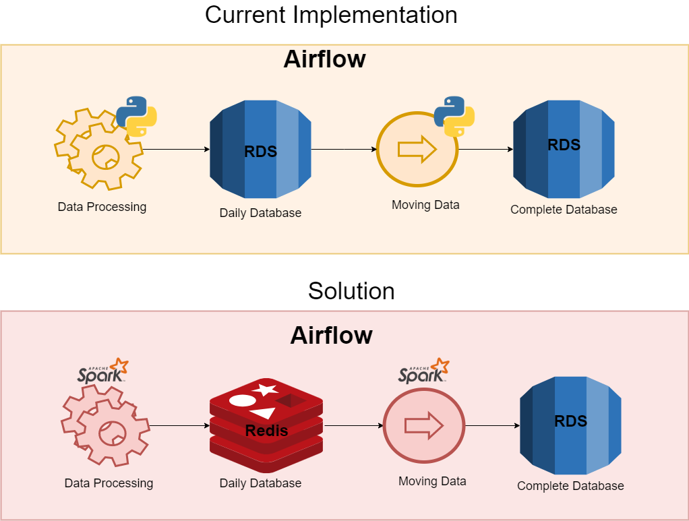

```{r setup, include=FALSE}
knitr::opts_chunk$set(echo = TRUE)
```

## Tarea 1

Escoje una de los proyectos / retos que llegaron a la lista que hicimos en clase. Ahora en mas detalle describe lo siquiente:

### Analisis

Descripción del proyecto: un ETL encargado de procesar información existente sobre Marcas registradas, además de procesar cualquier información diaria que pueda generarse sobre las mismas.

 - Cuales son los retos para analisis en terminos de metodologia y capacidad de computo.
 Se debe procesar información diaria de las marcas registradas de 126 países (aunque no todos registran nuevos datos todos los días), lo cual implica procesar cientos de archivos (en formato XML) por cada ejecución del pipeline. Si se produce algún error, el ETL debe detenerse y luego ponerse al día con la información una vez se marque el error como "resuelto". Además todo información nueva debe ser verificada contra la información existente en la base de datos, para evitar duplicidad y por este último aspecto, se presentó un problema de arquitectura, debido a que a pesar de existir índices en la base de datos, la verificación de la información entrante es cada vez más lenta, debido a que cada vez hay más datos por verificar. 
 
 - Que tipo de soluciones necesitas para solucionarlo (puede ser conceptual, no necesariamente necesitas buscar la tecnologia existente para resolverlo).  
  Se necesita una nueva estrategia para el constante ingreso de datos y evitar la duplicidad de los mismos, ya que conforme aumente el tamaño de la base datos, va a ser cada vez más inmanejable la verificación de la información. El ETL maneja dos bases de datos, una de ellas conocia como "daily database" donde se inserta la información diaria y la otra es conocida como "complete database", donde se almacena toda la información que se posee hasta la fecha. La idea detrás de esto es usar el "daily" como una fase de preparación, ya que la información entrante se limpia, analiza y si ocurre algún error durante la ejecución, dicha base de datos solo se borra y el proceso se inicia de nuevo. Con esto la información que se mueve a la base de datos principal (complete database) esta lista para ser usada para crear nuevos registros o actualizar los ya existentes. Actualmente ambas bases de datos se encuentran en un RDS en AWS, por lo que una de la soluciones es mover la base de datos secundaria (daily database) a una infraestructura de Amazon ElastiCache utilizando Redis, ya que esto mejoraría considerablemente la velocidad de procesamiento de la información ya que todo se ejecutaría en memoria y el que sea volátil no es un inconveniente, ya que este base de datos secundaria se limpia todos los dias antes de iniciar el proximo pipeline. Además para la ejecución del pipeline se utiliza Airflow como planificador (scheduler) y es el encargado de procesar todo el manejo de la información por medio de trabajores (workers) con propósitos específicos, por lo que se ha propuesto dejar a Airflow como scheduler, pero utilizar Spark para el proceso de la información, ya que el mismo realizaría todo este procesamiento en memoria, lo que implica una mejora en el desempeño de la aplicación.

### Infraestructura

 - Cuales son los retos infraestructurales para trabajar con este tipo de datos
 El no contar con servidores o bases de datos lo suficientemente potentes puede implicar un problemas para el ETL debido a que tiene que procesar información que se genera diariamente y la ejecución de un día específico debe terminar ese mismo día. Aunque se solucione el problema infraestructural de la base de datos, los servidores y bases de datos deben poseer la capacidad necesaria y eso implica una inversión considerable.
 
 - Que tipo de soluciones necesitas para solucionarlo (puede ser conceptual, no necesariamente necesitas buscar la tecnologia existente para resolverlo).

Como se mencionó en la solución para metodologia y capacidad de computo, sería necesario utilizar Redis en Amazón ElastiCache lo cual implicaría un  mayor costo para el cliente.
 
 - Crea un diagrama de la solución como lo piensas (entrega la imagen o incluyela como imagen en el Rmarkdown).
 
 
 
